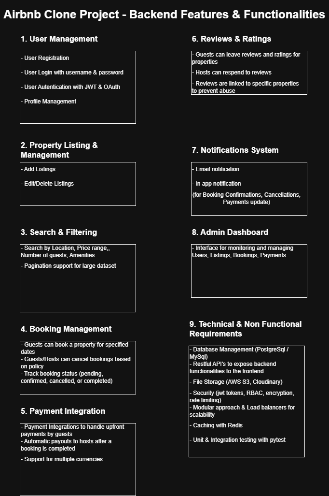

# Airbnb Clone Documentation

This document provides a visual representation of the core features and functionalities supported by the backend of the Airbnb Clone project. It outlines the system's architecture and major modules, showcasing how users, listings, bookings, payments, and administrative tasks are handled.

