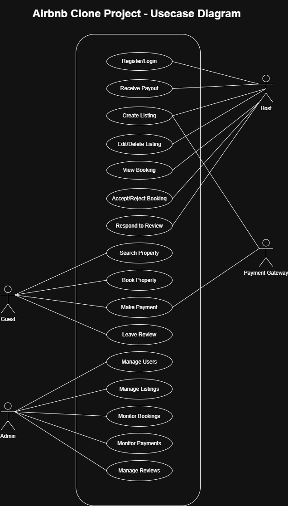

# Airbnb Clone Documentation (Usecase Diagram)
The use case diagram provides a high-level overview of the system’s functionality from the perspective of its users. It identifies the primary actors (such as admins, hosts, and guests) and outlines their interactions with the system, including actions like registering, booking properties, managing listings, making payments, and leaving reviews. This diagram helps visualize user roles and the core features they access within the application.

## Usecase Diagram
